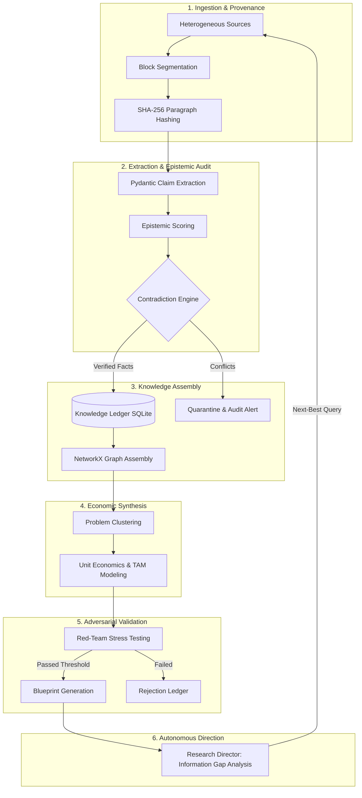

# Autonomous Economic Intelligence & Opportunity Engine

An evidence-grounded, sovereign intelligence system engineered to autonomously research market ecosystems, anchor claims to cryptographic provenance, resolve factual contradictions, discover high-leverage business problems, model economic viability, stress-test opportunities adversarially, and synthesize executable architecture blueprints.

---

## Table of Contents

1. [Project Overview](#1-project-overview)
2. [Problem Being Solved](#2-problem-being-solved)
3. [System Objective](#3-system-objective)
4. [Core Intelligence Loop](#4-core-intelligence-loop)
5. [Architecture Overview](#5-architecture-overview)
6. [Major Components](#6-major-components)
7. [Autonomous Research Pipeline](#7-autonomous-research-pipeline)
8. [Evidence and Provenance](#8-evidence-and-provenance)
9. [Epistemic Model](#9-epistemic-model)
10. [Knowledge Graph](#10-knowledge-graph)
11. [Problem Discovery](#11-problem-discovery)
12. [Opportunity Discovery](#12-opportunity-discovery)
13. [Economic Analysis](#13-economic-analysis)
14. [Opportunity Validation](#14-opportunity-validation)
15. [Research History & Memory](#15-research-history--memory)
16. [Research Director & Next-Best Research](#16-research-director--next-best-research)
17. [Learning Architecture](#17-learning-architecture)
18. [Security Model](#18-security-model)
19. [Infrastructure Integrations](#19-infrastructure-integrations)
20. [Repository Structure](#20-repository-structure)
21. [Technology Stack](#21-technology-stack)
22. [Installation](#22-installation)
23. [Environment Configuration](#23-environment-configuration)
24. [Running Locally](#24-running-locally)
25. [Running Tests](#25-running-tests)
26. [Deployment](#26-deployment)
27. [Current Capabilities](#27-current-capabilities)
28. [Known Limitations](#28-known-limitations)
29. [Roadmap](#29-roadmap)
30. [License Information](#30-license-information)

---

## 1. Project Overview

The **Autonomous Economic Intelligence & Opportunity Engine** is an enterprise-grade, local-first intelligence platform. Rather than generating speculative business plans through unconstrained generative prompts, this platform functions as a falsification-based evidence compiler. It ingests multi-channel unstructured data (PDFs, Word documents, financial filings, academic papers, and live web research), establishes paragraph-level cryptographic provenance via SHA-256 digests, extracts typed falsifiable claims, flags empirical contradictions across sources, models quantitative unit economics, and subjects every proposed opportunity to rigorous adversarial stress-testing.

---

## 2. Problem Being Solved

Traditional market intelligence and automated AI business analysis suffer from systemic flaws:
* **Hallucination & Speculative Drift:** Foundation models generate convincing narratives decoupled from empirical reality or actual market demand.
* **Unverifiable Citations:** Generated insights lack strict citation chains, making it impossible to audit which source paragraph verified a specific market size or growth figure.
* **Ignored Factual Contradictions:** Standard retrieval-augmented generation (RAG) pipelines blend conflicting reports without reconciling numerical or factual discrepancies.
* **Naive Economic Projections:** Most AI agents estimate arbitrary multi-billion-dollar TAMs without modeling margin compression, customer acquisition friction, regulatory barriers, or incumbent platform risk.

---

## 3. System Objective

To transform raw, heterogeneous information into verified, auditable economic intelligence by:
1. Guaranteeing cryptographic provenance for every extracted assertion.
2. Formally evaluating epistemic verifiability and falsifiability.
3. Automatically identifying and quarantining factual contradictions across independent sources.
4. Discovering genuine market bottlenecks, compliance burdens, and underserved workflows.
5. Computing grounded economic metrics (TAM, SAM, SOM, CAC/LTV, payback windows).
6. Conducting adversarial red-team simulations to kill weak opportunities before investment.
7. Designing modular, production-ready system architecture blueprints for surviving opportunities.

---

## 4. Core Intelligence Loop

The operational intelligence loop operates continuously through six structured phases:



---

## 5. Architecture Overview

The system is decoupled into five distinct functional planes:
1. **Control & Governance Plane:** Ephemeral JWT identity broker, out-of-process Open Policy Agent (OPA) validation, and immutable reverse-delta audit logging.
2. **Orchestration & Runtime Plane:** Pipeline executors, research director, claim extractors, and adversarial validators.
3. **Model Gateway Plane:** Multiplexed inference across OmniRoute (`:20128`), FreeLLMAPI (`:3001`), direct Frontier APIs (Gemini, OpenAI), and deterministic mock baselines.
4. **Storage & Ledger Plane:** Relational SQLite database (`intelligence_ledger.db`), topological graph representations (`NetworkX`), and cryptographic audit logs.
5. **Presentation & API Plane:** Asynchronous FastAPI server (`:8000`) and interactive browser-based intelligence dashboard.

---

## 6. Major Components

| Component | Directory | Responsibility | Implementation Status |
| :--- | :--- | :--- | :--- |
| **Unified Model Gateway** | `src/gateway/` | Inference routing, provider failover, local daemons | **Implemented** |
| **Ingestion Engine** | `src/ingestion/` | Multi-format parsing (PDF, DOCX, TXT, Web, RSS) | **Implemented** |
| **Claim Extractor** | `src/extraction/` | Structured Pydantic extraction, entity resolution | **Implemented** |
| **Epistemic Evaluator** | `src/epistemic/` | Verifiability, falsifiability, and confidence scoring | **Implemented** |
| **Contradiction Detector** | `src/extraction/` | Pairwise cross-source conflict detection | **Implemented** |
| **Knowledge Graph** | `src/knowledge_graph/` | Graph topology, node linking, causal traversal | **Implemented** |
| **Opportunity Engine** | `src/opportunity/` | Problem discovery, TAM/SAM/SOM, unit economics | **Implemented** |
| **Adversarial Validator** | `src/opportunity/` | Devil's advocate red-teaming, platform risk evaluation | **Implemented** |
| **Blueprint Generator** | `src/opportunity/` | System architecture & technical specification synthesis | **Implemented** |
| **Storage & Audit Ledger** | `src/storage/` | SQLite ledger, reverse-delta transaction history | **Implemented** |
| **Policy & Governance (OPA)**| `src/governance/` | Rego policy evaluation, ephemeral task tokens | **Implemented** |
| **Research Director** | `src/director/` | Information-gap calculation, next query synthesis | **Partially Implemented** |
| **Learning Architecture** | `src/learning/` | Meta-evaluator, heuristic weight calibration | **Partially Implemented** |
| **Web UI Dashboard** | `frontend/`, `src/api/` | Real-time visual monitoring & exploration UI | **Implemented** |

---

## 7. Autonomous Research Pipeline

1. **Corpus Ingestion:** Loads documents from local directories or fetches remote resources via web endpoints.
2. **Text Normalization:** Strips HTML, boilerplate, and scripts, normalizing unicode characters and paragraph boundaries.
3. **Block Segmentation:** Divides raw documents into cohesive semantic units.
4. **Claim Ingestion:** Passes units through model extraction prompts governed by strict JSON schemas.
5. **Provenance Anchoring:** Pairs each extracted fact with its originating block hash and metadata.
6. **Cross-Examination:** Cross-references newly extracted facts against existing entries in the ledger to detect contradictions or reinforce confidence.

---

## 8. Evidence and Provenance

The system enforces cryptographic provenance down to the paragraph level:
* Every paragraph receives a SHA-256 hash:
  $$\text{Block Hash} = \text{SHA256}(\text{Normalized Paragraph Text})$$
* Claims store an explicit foreign key relationship to their source block hash.
* If an analyst clicks an opportunity claim in the dashboard, the system traces directly back to the exact source document, paragraph number, and immutable cryptographic digest.
* Inquiries lacking verifiable block hashes are rejected from entry into the primary knowledge ledger.

---

## 9. Epistemic Model

Claims are not treated as binary truths, but as probabilistic assertions with quantified epistemic properties:
* **Verifiability ($[0.0, 1.0]$):** Degree to which the claim cites verifiable external references, empirical experiments, or official statistics.
* **Falsifiability ($[0.0, 1.0]$):** Whether the claim establishes clear criteria under which it could be proven false (e.g., concrete metrics, dates, operational bounds).
* **Source Authority ($[0.0, 1.0]$):** Weighted baseline for institutional, peer-reviewed, or primary financial sources versus informal blog posts.
* **Epistemic Composite Score:**
  $$\text{Score} = w_v \cdot \text{Verifiability} + w_f \cdot \text{Falsifiability} + w_a \cdot \text{Authority} - w_h \cdot \text{Hedging Penalty}$$

---

## 10. Knowledge Graph

The engine maintains a dynamic relational knowledge graph backed by `NetworkX` in memory and synchronized with SQLite:
* **Node Types:** `Source`, `ParagraphChunk`, `Claim`, `Entity`, `MarketProblem`, `Opportunity`.
* **Edge Types:** `EXTRACTED_FROM`, `MENTIONS`, `CONTRADICTS`, `EVIDENCES`, `SOLVES`, `DEPENDS_ON`.
* **Graph Queries:** Enables topological traversal to discover causal dependencies (e.g., *Which specific regulatory changes evidence this market bottleneck?*).

---

## 11. Problem Discovery

Rather than inventing arbitrary startup ideas, the engine discovers market problems by identifying clusters of high-confidence claims exhibiting:
* High recurring operational expenditure or labor bottlenecks.
* Unmet regulatory compliance burdens.
* Software fragmentation across disjointed workflows.
* Demonstrable willingness to pay (WTP) validated by historical procurement trends.

---

## 12. Opportunity Discovery

Opportunities are synthesized directly from validated problems:
* **Value Proposition:** Concise description of the intervention and economic impact.
* **Target Customer Profile (ICP):** Precise definition of the buyer and user personas.
* **Defensibility Moat:** Assessment of data network effects, switching costs, or domain-specific integrations.

---

## 13. Economic Analysis

Each opportunity receives an automated quantitative economic model:
* **Total Addressable Market (TAM):** Top-down industry sizing combined with bottom-up account multiplication.
* **Serviceable Addressable Market (SAM):** Geographic and technical subset addressable by the initial product scope.
* **Serviceable Obtainable Market (SOM):** Realistic 3-5 year capture target based on sales cycle benchmarks.
* **Unit Economics Simulation:**
  * Estimated Price Tier (Annual Contract Value / Subscription).
  * Gross Margin projections (accounting for LLM API and compute overhead).
  * Customer Acquisition Cost (CAC) and Lifetime Value (LTV) ratio modeling.
  * Payback window estimation.

---

## 14. Opportunity Validation

Before an opportunity is promoted to blueprint generation, it is subjected to an autonomous **Adversarial Red Team (Devil's Advocate)**:
* **Incumbent Platform Risk:** Evaluates whether major hyperscalers or existing SaaS suites could bundle this functionality as an incremental feature.
* **Regulatory & Legal Headwinds:** Evaluates compliance exposure, privacy constraints, and liability.
* **Distribution Fragility:** Flags customer acquisition channels that are vulnerable to algorithmic shifts or exorbitant ad spend.
* **Survival Score:** Opportunities with an adversarial risk score exceeding failure thresholds are quarantined or terminated.

---

## 15. Research History & Memory

* **Relational Ledger:** SQLite database (`intelligence_ledger.db`) storing historical research sessions, extracted claims, and opportunity states.
* **Reverse-Delta Audit Trail:** Every database mutation is logged with previous and updated state snapshots, allowing single-click rollback of unvalidated agent executions.
* **Historical Run Isolation:** Test suites and production workloads operate with clean execution boundaries.

---

## 16. Research Director & Next-Best Research

* **Implementation Status:** Partially Implemented.
* **Functionality:** The Research Director scans the knowledge graph for:
  1. High-value opportunities with low epistemic confidence scores.
  2. Unresolved factual contradictions.
  3. Sparse information clusters.
* **Next-Best Research Query:** Formulates structured search queries designed to find disconfirming evidence or fill critical data gaps. Fully autonomous recurring search execution is on the roadmap.

---

## 17. Learning Architecture

* **Implementation Status:** Partially Implemented (Prototype).
* **Mechanism:** The system tracks validation outcomes and incorporates a meta-evaluator that tunes heuristic extraction weights based on historical accuracy and user verification feedback.

---

## 18. Security Model

Security is enforced out-of-process rather than through natural language prompts:
* **Zero Secrets in Git:** Strict `.gitignore` policy; all sensitive variables managed via `.env` with a sanitized `.env.example` template.
* **Untrusted Web Data:** Ingested web data is stripped and treated as untrusted data inputs, never as system instructions.
* **Prompt Injection Defense:** Strict Pydantic JSON schemas reject unexpected instruction overrides.
* **Policy-as-Code (OPA):** Critical operations require approval from an Open Policy Agent (Rego) rule engine.
* **SSRF Protection:** Outbound requests strictly forbid private network subnets and cloud metadata endpoints.
* See [SECURITY.md](SECURITY.md) and [docs/security.md](docs/security.md) for full details.

---

## 19. Infrastructure Integrations

The engine supports modular integrations with external local services without coupling repository state:
* **OmniRoute (`http://localhost:20128`):** Enterprise multi-provider proxy providing automated retries and token budgeting.
* **FreeLLMAPI (`http://localhost:3001`):** Local zero-cost inference routing daemon.
* **Agent Reach:** Multi-channel social and web search integration (Exa, DuckDuckGo, Jina Reader).

---

## 20. Repository Structure

```
.
├── src/                               # Core Application Source Code
│   ├── api/                           # FastAPI server & REST endpoints
│   │   ├── server.py                  # API endpoints, status, and static mount
│   │   └── schemas.py                 # Request and response models
│   ├── director/                      # Autonomous Research Director
│   ├── epistemic/                     # Epistemic scoring & falsifiability logic
│   ├── extraction/                    # Pydantic claim extraction & contradiction detection
│   ├── gateway/                       # Unified Model Gateway (OmniRoute, FreeLLMAPI, Gemini, OpenAI)
│   ├── governance/                    # OPA Policy-as-Code & Identity Broker
│   ├── ingestion/                     # Multi-format document parser (PDF, DOCX, TXT, Web)
│   ├── knowledge_graph/               # Topological knowledge graph builder (NetworkX)
│   ├── learning/                      # Learning architecture & meta-evaluators
│   ├── opportunity/                   # Opportunity discovery, TAM, and adversarial validator
│   └── storage/                       # SQLite ledger, schema migrations, and audit trails
├── datasets/                          # Standardized research & benchmark documents
├── docs/                              # Engineering Documentation
│   ├── architecture.md                # Detailed architectural specifications
│   ├── development.md                 # Developer setup & local contribution guide
│   ├── deployment.md                  # Containerization & production deployment guide
│   ├── security.md                    # Threat model & OPA policy specification
│   ├── research-methodology.md        # Mathematical & epistemic research methodology
│   ├── limitations.md                 # Known boundaries & feature implementation status
│   ├── troubleshooting.md             # Common developer issues and solutions
│   ├── omniroute_integration.md       # OmniRoute integration guide
│   ├── freellmapi_integration.md      # FreeLLMAPI setup guide
│   └── agent_reach_integration.md     # Agent Reach search guide
├── frontend/                          # Web UI dashboard assets (HTML/CSS/JS)
├── tests/                             # Comprehensive Pytest test suite (101 unit/integration tests)
├── .env.example                       # Sanitized environment configuration template
├── .gitignore                         # Comprehensive repository exclusions
├── LICENSE                            # MIT License
├── pytest.ini                         # Pytest configuration
├── requirements.txt                   # Reproducible Python dependencies
├── run_mvp0.py                        # MVP-0 pipeline entrypoint
├── generate_datasets.py               # Dataset generation & benchmark synthesis script
└── README.md                          # Repository documentation
```

---

## 21. Technology Stack

* **Language:** Python 3.12+
* **Web Framework:** FastAPI, Uvicorn, Starlette
* **Data Validation:** Pydantic v2, Pydantic-Settings
* **Graph Modeling:** NetworkX
* **Document Parsing:** PyPDF, python-docx, BeautifulSoup4, Feedparser
* **HTTP & Networking:** HTTPX, Requests, WebSockets
* **Model Inference:** Google Generative AI, OpenAI, Anthropic, OmniRoute, FreeLLMAPI
* **Testing:** Pytest, Unittest Mock
* **Policy Governance:** Open Policy Agent (OPA) / Rego

---

## 22. Installation

### 1. Clone the Repository
```bash
git clone https://github.com/Yashv-22/autonomous-economic-intelligence-engine.git
cd autonomous-economic-intelligence-engine
```

### 2. Set Up Virtual Environment
```bash
# Linux/macOS
python3 -m venv .venv
source .venv/bin/activate

# Windows (PowerShell)
python -m venv .venv
.venv\Scripts\activate
```

### 3. Install Dependencies
```bash
pip install --upgrade pip
pip install -r requirements.txt
```

---

## 23. Environment Configuration

Copy the sanitized environment template:
```bash
cp .env.example .env
```

Edit `.env` to configure your preferred environment:
```ini
# Core Configuration
ENVIRONMENT=development
HOST=127.0.0.1
PORT=8000
DEFAULT_PROVIDER=mock  # Set to 'mock', 'omniroute', 'gemini', 'openai', or 'freellmapi'

# Model Gateway Keys (Optional if using 'mock')
GEMINI_API_KEY=
OPENAI_API_KEY=
GROQ_API_KEY=

# Local Routing Daemons (Optional)
OMNIROUTE_BASE_URL=http://localhost:20128
FREELLMAPI_BASE_URL=http://localhost:3001/v1
```

---

## 24. Running Locally

### Start the FastAPI Engine & Web UI
```bash
python -m uvicorn src.server.app:app --host 127.0.0.1 --port 8000 --reload
```

Open your browser to:
* **Interactive Intelligence Dashboard:** `http://127.0.0.1:8000/`
* **Swagger API Documentation:** `http://127.0.0.1:8000/docs`
* **System Status Health Check:** `http://127.0.0.1:8000/api/status`

### Execute CLI Pipeline
```bash
python run_mvp0.py
```

---

## 25. Running Tests

The test suite runs 100% offline using deterministic mock providers without external API costs:
```bash
python -m pytest tests/
```

Verify specific test areas:
```bash
python -m pytest tests/test_opportunity_engine.py
python -m pytest tests/test_gateway.py
python -m pytest tests/test_claim_extraction.py
```

---

## 26. Deployment

For Docker containerization, cloud VPC deployments, and reverse proxy configurations with TLS termination, see the [Deployment Guide](docs/deployment.md).

---

## 27. Current Capabilities

* [x] Multi-format document ingestion with paragraph-level SHA-256 provenance.
* [x] Strongly typed claim extraction with epistemic scoring.
* [x] Cross-source contradiction detection and quarantine.
* [x] Market problem clustering and TAM/SAM/SOM economic modeling.
* [x] Adversarial stress-testing and survival scoring.
* [x] Architecture blueprint synthesis with technical specifications.
* [x] Unified model gateway with automatic failover (OmniRoute, FreeLLMAPI, Gemini, OpenAI, Mock).
* [x] Reverse-delta transaction audit trail in SQLite.
* [x] FastAPI REST API with real-time web dashboard.

---

## 28. Known Limitations

* **Context Windows:** Extremely large documents require chunking to avoid attention degradation.
* **Complex Multi-Column PDFs:** Unstructured tables or non-OCR scanned documents may require pre-processing.
* **Graph Scale:** The current in-memory `NetworkX` graph is optimized for thousands of nodes; enterprise multi-million node graphs require migration to Neo4j.
* See [docs/limitations.md](docs/limitations.md) for details.

---

## 29. Roadmap

* [ ] **Milestone 1:** Fully autonomous recurring search loop driven by the Research Director.
* [ ] **Milestone 2:** Neo4j / Memgraph enterprise graph database sync.
* [ ] **Milestone 3:** Distributed gVisor container sandboxing on Kubernetes worker nodes.
* [ ] **Milestone 4:** Automated financial filings (SEC EDGAR 10-K/10-Q) continuous stream processor.

---

## 30. License Information

Distributed under the MIT License. See [LICENSE](LICENSE) for full legal text.
