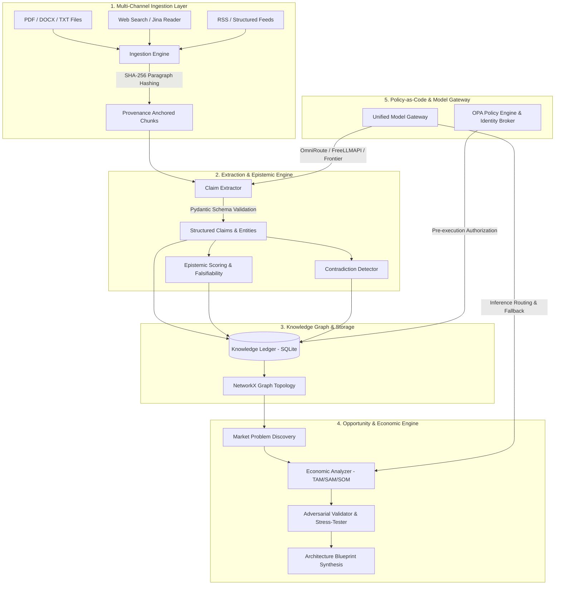

# System Architecture & Technical Specifications

## 1. Architectural Philosophy

The **Autonomous Economic Intelligence & Opportunity Engine** is an evidence-first, multi-tier intelligence pipeline designed to ingest unstructured documents and live web feeds, extract atomic falsifiable claims with paragraph-level cryptographic provenance, assemble an evolving knowledge graph, detect empirical contradictions, discover actionable market problems, and synthesize high-margin business opportunities with verifiable unit economics.

The system adheres to four core architectural tenets:
1. **Local-First & Sovereign Execution:** The engine runs entirely on local infrastructure or private VPC environments without mandatory third-party SaaS lock-in.
2. **Cryptographic Provenance:** Every claim and opportunity is anchored to an immutable SHA-256 hash of its source document paragraph.
3. **Out-of-Process Governance (OPA):** Critical mutations (database writes, opportunity promotion, outbound network access) must satisfy Open Policy Agent (Rego) policy-as-code before execution.
4. **Epistemic Certainty Modeling:** Information is strictly categorized across empirical verification scores, falsifiability metrics, and contradiction matrices.

---

## 2. Layered Architecture Overview

---

## 3. Component Breakdown

### 3.1 Unified Model Gateway (`src/gateway/`)
* **Role:** Multiplexes inference across multiple backends:
  * **OmniRoute (`:20128`):** Enterprise multi-provider proxy supporting Gemini, OpenAI, Claude, Groq, and DeepSeek with intelligent retry logic.
  * **FreeLLMAPI (`:3001`):** Local zero-cost model router with multi-provider failover.
  * **Direct Frontier APIs:** Native integrations with Google Gemini (`google-generativeai`) and OpenAI (`openai`).
  * **Mock Provider:** Offline deterministic test baseline enabling 100% reproducible test suites.
* **Fault Tolerance:** Configurable fallback chains (`active_provider` fallback to secondary providers or mock responses during network outages).

### 3.2 Ingestion & Cryptographic Provenance (`src/ingestion/`)
* **Role:** Parses raw textual data from PDFs (`pypdf`), Word documents (`python-docx`), plain text, and web streams.
* **Hashing Mechanism:** Computes SHA-256 digests at the block/paragraph level. Hashes accompany every extracted chunk throughout the entire lifecycle.

### 3.3 Epistemic Claim Extraction & Contradiction Engine (`src/extraction/`, `src/epistemic/`)
* **Role:** Converts raw chunks into typed, verifiable claims.
* **Attributes:**
  * `claim_id`: Unique deterministic identifier.
  * `source_hash`: SHA-256 origin hash.
  * `epistemic_score`: Float $[0.0, 1.0]$ measuring verifiability and empirical grounding.
  * `falsifiability`: Boolean indicator of whether the assertion can be empirically disproven.
* **Contradiction Detection:** Evaluates cross-source claim pairs to detect opposing numerical bounds, temporal shifts, or factual mismatches.

### 3.4 Knowledge Graph & Ledger Storage (`src/knowledge_graph/`, `src/storage/`)
* **Role:** Persists entities, claims, relationships, and opportunities.
* **Database:** SQLite relational ledger (`intelligence_ledger.db`) paired with an append-only audit trail.
* **Graph Topology:** In-memory `networkx.DiGraph` representing causal chains, dependency graphs, and citation networks.

### 3.5 Opportunity Discovery & Economic Analysis (`src/opportunity/`)
* **Role:** Synthesizes actionable business opportunities from validated market problems.
* **Sub-Modules:**
  * **Problem Discovery:** Aggregates validated claims highlighting unmet demand, regulatory shifts, or cost bottlenecks.
  * **Economic Modeling:** Computes addressable market sizing (TAM, SAM, SOM), gross margins, CAC/LTV projections, and operational payback periods.
  * **Adversarial Validation:** Simulates catastrophic failure modes, regulatory headwinds, and distribution vulnerabilities.
  * **Blueprint Generator:** Produces production-ready technical architecture proposals and MVP roadmaps.

### 3.6 Autonomous Research Director (`src/director/`)
* **Role:** Computes the information-theoretic delta across existing opportunities and identifies the *Next Best Research Query* to maximize systemic confidence.

### 3.7 Governance & Identity Control (`src/governance/`)
* **Role:** Out-of-process Open Policy Agent (OPA) integration evaluating Rego policies on tool usage, spend limits, and database mutations.
* **Identity Broker:** Issues ephemeral JWT tokens (60–120s TTL) for micro-task authorization.

---

## 4. API & Visualization Surface (`src/api/`, `frontend/`)

* **FastAPI Server (`src/api/server.py`):**
  * Port: `8000`
  * Endpoints:
    * `GET /api/status`: System health, active provider, DB stats, memory.
    * `GET /api/opportunities`: Filterable catalog of discovered opportunities.
    * `POST /api/research/trigger`: Initiates synchronous or async research cycles.
    * `GET /api/claims`: Indexed claims with epistemic filter parameters.
    * `GET /api/contradictions`: Detected factual contradictions.
    * `GET /api/audit-trail`: Cryptographic transaction log.
    * `GET /api/governance`: Active OPA rules and enforcement metrics.
* **Web UI Dashboard:** Accessible at `http://127.0.0.1:8000/`. Provides interactive visual inspection of opportunities, evidence audits, adversarial reports, and knowledge topology.
