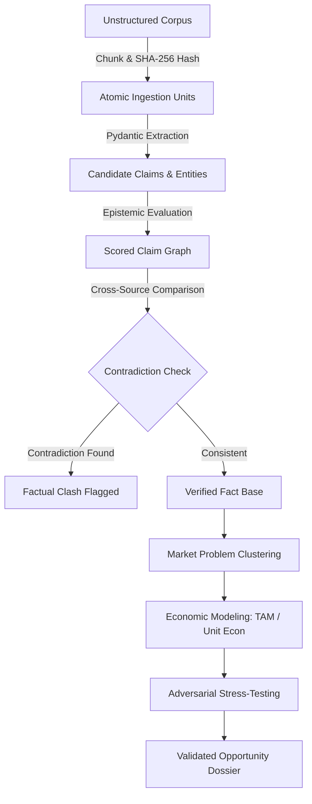

# Autonomous Research & Epistemic Methodology

## 1. Methodology Overview

The **Autonomous Economic Intelligence & Opportunity Engine** replaces subjective heuristics with a rigorous, falsification-based analytical methodology. Rather than treating LLM generations as truth, the engine operates as an adversarial evidence compiler that transforms raw, unverified documents into quantified, audited opportunities.

---

## 2. Ingestion & Paragraph-Level Cryptographic Provenance

Every incoming document (PDF, Word, TXT, Web Scrape) undergoes deterministic block segmentation:
1. Text is normalized and divided into cohesive paragraphs or semantic blocks.
2. For each block, a cryptographic SHA-256 digest is generated:
   $$\text{Block Hash} = \text{SHA256}(\text{Normalized Content})$$
3. The digest is immutably linked to the source metadata (URL, file path, publication date, author).
4. Every extracted claim explicitly inherits this `source_hash`. Without a valid hash pointing to an ingested chunk, a claim cannot enter the knowledge ledger.

---

## 3. Epistemic Scoring & Falsifiability

Every candidate claim is evaluated against epistemic criteria:
* **Verifiability:** Can the assertion be independently verified with concrete empirical data or secondary references?
* **Falsifiability:** Does the claim establish bounded conditions under which it could be proven false (e.g., specific dollar figures, percentages, dates, or mechanical limits)? Unfalsifiable marketing assertions are down-weighted.
* **Epistemic Score:** A composite metric $[0.0, 1.0]$ reflecting:
  $$\text{Epistemic Score} = w_1 \cdot \text{Verifiability} + w_2 \cdot \text{Falsifiability} + w_3 \cdot \text{Source Authority} - w_4 \cdot \text{Hedging Factor}$$

---

## 4. Contradiction Detection Engine

To guard against misinformation and hallucination, the engine executes pairwise comparison across claims referencing identical entities, markets, or metrics:
* **Numerical Contradictions:** E.g., Source A states "Market size is \$1.2B" while Source B asserts "Market size is \$180M".
* **Directional Contradictions:** E.g., Source A states "Adoption is accelerating at 45% CAGR" while Source B reports "Churn has doubled and customer acquisition has stalled".
* **Contradiction Resolution:** When a clash is detected, both claims are quarantined, the contradiction is indexed in the ledger, and the Research Director can dispatch targeted verification subtasks.

---

## 5. Market Problem Discovery & Clustering

Problems are synthesized from clusters of related claims:
* **Bottleneck Identification:** Identifying acute pain points where businesses or consumers incur disproportionate labor, compliance, or compute costs.
* **Regulatory Catalysts:** Detecting impending regulatory mandates or compliance shifts that render existing solutions obsolete.
* **Willingness to Pay (WTP):** Assessing economic urgency and historical budget allocation to solve the target pain point.

---

## 6. Economic Modeling & Unit Economics

Opportunities derived from validated problems must undergo quantitative economic modeling:
* **Total Addressable Market (TAM):** Top-down and bottom-up market sizing.
* **Serviceable Addressable Market (SAM) & Obtainable Market (SOM):** Constrained by initial go-to-market and ICP segmentation.
* **Unit Economics Simulation:**
  * Customer Acquisition Cost (CAC) estimates based on target channel benchmarks.
  * Lifetime Value (LTV) calculated from estimated pricing tiers, gross margins, and projected retention.
  * Payback period and capital efficiency ratios.

---

## 7. Adversarial Validation (Devil's Advocate)

Before an opportunity is promoted to architectural blueprint status, an autonomous adversarial agent attempts to invalidate it:
* **Platform Risk:** Could an incumbent (e.g., Microsoft, Google, AWS) commoditize or wipe out this solution with an API update?
* **Distribution Fragility:** Are acquisition channels prohibitively expensive or gated by monopolistic gatekeepers?
* **Execution Complexity:** Does the solution require unproven scientific breakthroughs or untenable operational overhead?
* **Outcome:** Only opportunities scoring above the adversarial survival threshold are deemed viable.
