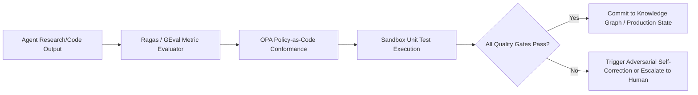

# System Evaluation Framework, Benchmarks & Metrics

**Author:** Principal AI Systems Architect & Research Director  
**Date:** September 2026  
**Status:** Canonical Evaluation & Quality Specification (Phase 0)  

---

## 1. Executive Summary & Evaluation Philosophy

Evaluating an autonomous intelligence system cannot rely on subjective prompt inspection or vanity metrics (e.g., total tokens generated, raw tool call counts). Because the system is designed to identify real organizational pathologies and design economic interventions, evaluation must be **rigorous, quantitative, reproducible, and tied directly to operational ground truth**.

This document defines the **Multi-Dimensional Quality Framework**, establishes benchmark datasets, and specifies the automated regression gates required to validate system capabilities at every phase.

---

## 2. Multi-Dimensional Quality Taxonomy

```
+----------------------------------------------------------------------------------------------------+
|                                EVALUATION QUALITY DIMENSIONS                                       |
+----------------------+-----------------------------------------------+-----------------------------+
| Evaluation Vector    | Concrete Metric                               | Target Production Standard  |
+----------------------+-----------------------------------------------+-----------------------------+
| **1. Factual &**     | Citation Precision ($P_{\text{cite}}$)        | $\ge 98.0\%$                |
| **Citation Rigor**   | Hallucination Rate ($H_{\text{rate}}$)        | $\le 1.0\%$                 |
|                      | Span-Match Accuracy to Raw PDF/Source         | $\ge 95.0\%$                |
+----------------------+-----------------------------------------------+-----------------------------+
| **2. Problem**       | False Positive Rate on Validated Cases        | $\le 5.0\%$                 |
| **Discovery**        | Problem Classification F1-Score               | $\ge 0.90$                  |
|                      | Cross-Source Corroboration Depth              | $\ge 3$ independent sources |
+----------------------+-----------------------------------------------+-----------------------------+
| **3. Hypothesis**    | Falsifiability Score ($S_{\text{falsify}}$)   | $\ge 0.92$ (Formal logic)   |
| **Validity**         | Red-Team Contradiction Discovery Rate         | $\ge 85.0\%$ of edge cases  |
+----------------------+-----------------------------------------------+-----------------------------+
| **4. Opportunity**   | Scoring Calibration Error vs. Audited Case    | $\le \pm 12.0\%$ variance   |
| **Economics**        | Sensitivity Analysis Completeness             | 100% boundary conditions    |
+----------------------+-----------------------------------------------+-----------------------------+
| **5. Code & Tool**   | Unit & Integration Test Pass Rate             | $100.0\%$ (Sandboxed CI)    |
| **Synthesis**        | Static Analysis Security Violations           | $0$ Critical / High         |
|                      | Schema Conformance Rate                       | $100.0\%$ valid JSON schema |
+----------------------+-----------------------------------------------+-----------------------------+
| **6. Operational**   | Unit Cost per Validated Problem Record        | $\le \$3.50$ in tokens      |
| **Economics**        | Straight-Through Execution Rate ($\alpha$)    | $\ge 85.0\%$ target         |
|                      | Mean Time to Synthesize Dossier (MTTD)        | $\le 180\text{ seconds}$    |
+----------------------+-----------------------------------------------+-----------------------------+
```

---

## 3. Detailed Metric Formulations

### 3.1 Citation Precision & Hallucination Rate
Every extracted claim $C_i$ must map directly to a verified source span $S_i$ with an SHA-256 hash in the source document store:

$$P_{\text{cite}} = \frac{\sum_{i=1}^{N} \mathbb{I}(\text{VerifyHash}(C_i, S_i) == \text{True})}{N}$$

If an agent attributes a claim to a source where the concept is absent or materially distorted, the submission is failed and penalized.

### 3.2 Hypothesis Falsifiability Scoring
Evaluated using automated logic verification:
1.  Are testable dependent and independent variables explicitly isolated?
2.  Is a mathematical null hypothesis ($H_0$) defined?
3.  Are concrete empirical conditions specified under which the hypothesis would be disproved?

---

## 4. Benchmark Datasets

To ensure reliable evaluation, the system is benchmarked against three distinct evaluation suites:

```
+------------------------------------------------------------------------------------+
|                             EVALUATION BENCHMARK SUITES                            |
+------------------------------------------------------------------------------------+
| 1. SYNTHETIC GROUND TRUTH SUITE (50 Injected Organizational Anomaly Graphs)        |
|    - Contains pre-constructed value streams with known handoff bottlenecks         |
|    - Tests Problem Discovery Agent precision, recall, and root-cause localization  |
+------------------------------------------------------------------------------------+
| 2. HISTORICAL ENTERPRISE CASE REPOSITORY (25 Audited Post-Mortems)                 |
|    - Real-world operating model redesign cases from McKinsey, BCG, HBR            |
|    - Benchmarks Opportunity Scoring calibration against audited financial outcomes |
+------------------------------------------------------------------------------------+
| 3. ADVERSARIAL RED-TEAM PROMPT SUITE (200 Injection & Distortion Probes)          |
|    - Conflicting vendor claims, biased studies, subtle factual contradictions      |
|    - Evaluates Evidence Validation Agent and Watchdog resilience                   |
+------------------------------------------------------------------------------------+
```

---

## 5. Automated Evaluation & Continuous CI/CD Quality Gates



1.  **Level 1 Gate (Pre-Commit Schema & Citation Check):** Deterministic verification that all JSON keys are present, source hashes match, and no ungrounded claims exist.
2.  **Level 2 Gate (Adversarial Red-Team Review):** Independent Evaluator Agent (`AGENT-WATCH-012`) runs counter-queries to stress-test logical conclusions.
3.  **Level 3 Gate (Sandbox Execution):** All synthesized code must compile, pass 100% of unit tests, and achieve 0 linter warnings in an isolated container before artifact promotion.
