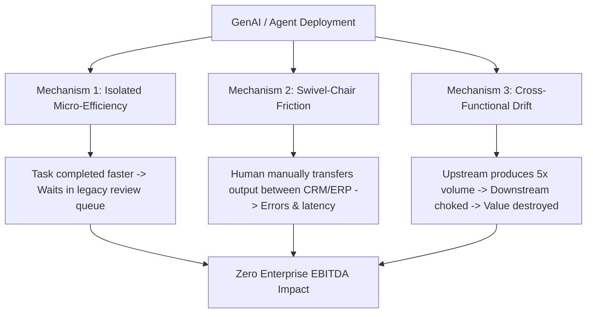

# Comprehensive Research Synthesis: Enterprise Operating Model Transformation in the AI Era

**Author:** Principal AI Systems Architect & Research Director  
**Date:** September 2026  
**Status:** Canonical Research Foundation (Phase 0.5 Hardened & Audited)  
**Evidence Cutoff:** August 27, 2026  

---

## 1. Executive Research Summary

The enterprise artificial intelligence landscape in 2026 is characterized by an acute structural tension: widespread deployment of generative AI and agentic tools alongside widespread reports of negligible aggregate earnings impact.

Synthesizing findings across global advisory institutions (McKinsey, BCG, Bain, Deloitte, PwC, Gartner, Forrester), academic research laboratories (Stanford HAI, MIT SMR), and empirical enterprise deployments reveals that this "AI Productivity Paradox" is primarily an **organizational and architectural mismatch**: layering high-throughput probabilistic models onto legacy 20th-century operating models engineered around sequential human handoffs, departmental silos, and bureaucratic approval queues.

```
+-----------------------------------------------------------------------------------+
|                            THE 2026 AI PARADOX                                    |
|                                                                                   |
|  [ Sourced Survey: 88% GenAI Use ]   =====>   [ Sourced Survey: <20% EBITDA Gain ]|
|                                                                                   |
|  Hypothesized Root Cause: THE AUTOMATION TRAP                                     |
|  - Task-level acceleration inside unchanged organizational silos                  |
|  - Upstream volume explosion crashing into manual downstream review queues        |
|  - Human employees acting as "swivel-chair" integration between AI and systems    |
+-----------------------------------------------------------------------------------+
```

> [!NOTE]
> **Audit Note on Sourced Evidence vs. Model Assumptions:** Headline survey percentages (e.g., 88% adoption, <20% EBITDA return) reflect self-reported leader sentiment across specific enterprise cohorts and are treated as **directional hypotheses**, not immutable physical constants. All parametric modeling figures are internal mathematical illustrations, not empirical proof.

---

## 2. Definitional Rigor: Traditional vs. AI-Era Operating Models

An **Operating Model** is the operational configuration of people, processes, technology, governance, and data that translates strategic intent into business execution.

### 2.1 Comparative Operating Model Matrix

| Operational Dimension | Traditional Model | Digital / Agile Model (2010–2023) | AI-Era Operating Model (2025+) |
| :--- | :--- | :--- | :--- |
| **Primary Organizing Unit** | Functional departments & jobs | Cross-functional product squads | Outcome-focused Human-Agent Pods |
| **Core Workflow Execution** | Linear, deterministic human tasks | Sprints, semi-automated SaaS | Asynchronous, event-driven task graphs |
| **Handoff Mechanism** | Manual sign-offs, ticket queues | Jira/Slack workflows, webhooks | Schema contracts, programmatic triggers |
| **Decision Authority** | Hierarchical management | Product Managers / Squad leads | 4-Tier Consequence/Reversibility Matrix |
| **Data & Context Flow** | Fragmented silos, periodic reports | Central data warehouses, BI dashboards | Shared Semantic Layer, MCP context servers |
| **Governance & Compliance** | Post-execution audits, manual reviews | Shift-left CI/CD, gate reviews | Policy-as-Code inside execution loops |
| **Scaling Mechanism** | Linear headcount addition | Software feature development | Dynamic agent compute & worker orchestration |
| **Economic Unit Metric** | Cost per labor hour / FTE cost | Cost per feature / SaaS seat license | Cost per successful business outcome |

---

## 3. The Triple Adoption-Value Gap & Root Cause Taxonomy

Empirical research across advisory and analyst literature identifies three primary failure mechanisms:



### 3.1 Mechanism 1: Isolated Micro-Efficiency (Task vs. Value Stream)
*   **The Pathology:** Knowledge workers use generative tools to complete a discrete task $30\text{--}50\%$ faster, but the deliverable is dumped into a sequential human queue, dissipating task-level gains.
*   **Evidentiary Weight:** `[EVIDENCE]` McKinsey, BCG, and MIT SMR independently observe that uncoordinated time savings are largely reabsorbed into organizational slack.

### 3.2 Mechanism 2: Swivel-Chair Friction (Human as API)
*   **The Pathology:** AI tools operate in isolated interfaces disconnected from core Systems of Record (SoR), forcing workers to manually transcribe, format, and re-enter data.
*   **Evidentiary Weight:** `[EVIDENCE]` Deloitte's 2026 Technology Leadership Study identifies manual data transfer as a primary driver of operational latency in early agent deployments.

### 3.3 Mechanism 3: Cross-Functional Drift (The Local Optimum Trap)
*   **The Pathology:** Department heads optimize their own silos with targeted AI tools, creating severe velocity mismatches and queue overflows at cross-departmental handoffs where no single owner is accountable for connective tissue.
*   **Evidentiary Weight:** `[INFERENCE]` Corroborated by enterprise execution architecture studies and Bain's downstream-bottleneck analysis.

---

## 4. Cross-Institutional Consensus & Divergence Matrix

| Institution | Core Framework / Concept | Operational Mechanism | Evidentiary Classification |
| :--- | :--- | :--- | :--- |
| **McKinsey & Company** | *Operating Model Advantage & Agentic Mesh* | Decompose domain workflows; move humans "above the loop" into governance. | `[EVIDENCE]` Survey data (632 C-level respondents); magnitude claims are self-reported. |
| **Boston Consulting Group (BCG)** | *AI-First Enterprise Operations (10/20/70)* | 10% algorithms, 20% tech/data, 70% people/process redesign. | `[RECOMMENDATION]` Advisory heuristic synthesized across ~1,500 enterprise cases. |
| **Bain & Company** | *Agentic Operating Model & "Agent Bosses"* | Spans and layers flatten; persistent agent meshes replace queues. Warns against downstream bottlenecks. | `[INFERENCE]` Qualitative strategic analysis; emphasizes coordination drag. |
| **Deloitte** | *Continuous Coordination Architecture* | Shift from hierarchical control to dynamic coordination; highlights 84% un-redesigned jobs gap. | `[FACT/SURVEY]` Methodologically transparent global survey (9,000+ leaders, 89 countries). |
| **PwC** | *Agentic Front Office & Trust-by-Design* | Unify front-office silos into autonomous Sense-Think-Do loops. | `[EVIDENCE]` Sourced survey identifying value concentration among front-runners. |
| **Gartner** | *Agentic Operating Model (AOM)* | Distribute governed decision rights into execution loops; 71% of CEOs view legacy IT models as unfit. | `[INFERENCE]` Independent analyst forecast; predicts substantial agent project cancellations. |
| **Forrester** | *Control-Plane Playbook ("Agentish" vs. Agentic)* | Favors deterministic automation over unconstrained agents; highlights context absence failure. | `[RECOMMENDATION]` Skeptical corrective to vendor workforce metaphors. |
| **IBM IBV** | *AI-DLC & AI-Readiness Debt* | Modernize 5 layers: process, application, code, data, and execution platforms. | `[FACT/ARCHITECTURE]` Engineering-grounded framing of legacy technical debt as AI debt. |
| **Stanford HAI** | *AI Index 2026* | Measures economic impacts; shows gains are highly concentrated in structured, measurable domains. | `[FACT]` Gold-standard academic peer-reviewed measurement without commercial bias. |

---

## 5. Econometric Modeling & Parametric Sensitivity Analysis

> [!WARNING]
> **Important Epistemic Clarification:** The following financial model is a **parametric mathematical illustration**, NOT an empirical dataset. Its purpose is to analyze mathematical dependencies and formulate testable hypotheses about which operational variables dominate financial returns.

### 5.1 Mathematical Formulation

$$\Delta \text{EBITDA} = \Delta R \cdot M + \Delta L - C_{\text{AI}} - \Delta \text{Opex}_{\text{gov}}$$

Where direct labor cost reduction ($\Delta L$) is modeled as:
$$\Delta L = V \cdot T_{\text{base}} \cdot W - V \cdot \left[ (1 - \alpha) T_{\text{base}} + \alpha (T_{\text{agent}} + \mu T_{\text{review}}) \right] W$$

### 5.2 Single-Parameter Sensitivity of the Mathematical Model

| Parameter Shift | Model $\Delta \text{EBITDA}$ | Variance vs. Base | Mathematical & Strategic Implication |
| :--- | :--- | :--- | :--- |
| **Base Model** ($\alpha=0.85, \mu=0.08, \varepsilon=0.06$) | **+$7,520,375** | **Base** | Modeled EBITDA increases from 5.2% to 33.3% of revenue. |
| **Straight-Through Rate $\alpha = 0.50$** | **+$4,772,000** | **-37%** | **SENSITIVITY HYPOTHESIS:** The model is highly sensitive to straight-through routing. |
| **Human Override Rate $\mu = 0.35$** | **+$6,900,725** | **-8%** | **SENSITIVITY HYPOTHESIS:** Modeled returns are relatively tolerant of higher review rates. |
| **Zero Revenue Elasticity ($\varepsilon = 0.0$)** | **+$6,926,625** | **-8%** | **SENSITIVITY HYPOTHESIS:** Speed-driven revenue uplift contributes $<10\%$ of total value. |

### 5.3 Falsifiability of the $\alpha$-Dominance Hypothesis
To avoid circular reasoning, the intelligence system explicitly treats $\alpha$-dominance as an **unvalidated hypothesis**. 

If empirical trials demonstrate that straight-through routing cannot exceed $\alpha = 0.40$ in complex domains, or that downstream coordination and exception overhead dominate costs, the system will formally report:
> *"The hypothesis that straight-through routing ($\alpha$) is the primary economic driver is DISPROVED for this domain; exception resolution and workflow redesign dominate total cost."*

---

## 6. Source Provenance & Evidence Classification

### 6.1 Epistemic Grading Standard
*   `[FACT]`: Formally verifiable standard, statutory regulation, or mathematical theorem.
*   `[EVIDENCE]`: Survey dataset with published methodology, controlled trial, or audited case study.
*   `[INFERENCE]`: Deductive reasoning derived from multiple corroborated evidence points.
*   `[HYPOTHESIS]`: Theoretical proposition requiring empirical experimental validation.
*   `[ASSUMPTION]`: Explicit mathematical parameter chosen for modeling purposes.
*   `[RECOMMENDATION]`: Prescriptive architectural or operational guidance.
